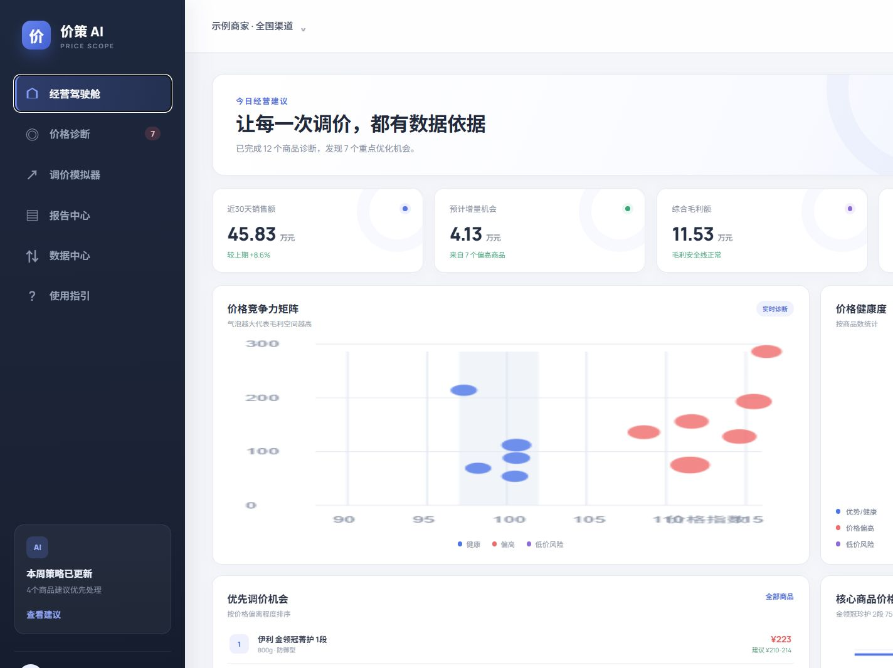

# 价策 AI｜电商商家智能定价与价格情报系统

> 从“看竞品价格”升级为“知道为什么调、调到多少、调后会怎样”。



这是一个面向电商运营、品类经理和定价团队的产品型作品。系统覆盖多平台价格与优惠采集、真实到手价核算、同款归一、价格诊断、价格拐点、调价模拟和分层报告。演示货盘覆盖母婴奶粉、食品饮料、家用电器和个护清洁，并支持通过 CSV 动态扩展品类。

## 面试快速入口

- [产品展示说明](price-scope-ai/docs/产品展示说明.md)：产品问题、设计逻辑、核心链路、效果截图、技术架构与面试讲解提纲
- [产品使用说明](price-scope-ai/docs/产品使用说明书.md)：从启动、采集、诊断、模拟到报告的完整操作方法
- [可运行产品](price-scope-ai/)：前端、采集服务、测试、示例数据和文档均集中在此目录
- [Word 使用说明书](price-scope-ai/docs/价策AI产品使用说明书.docx)

## 核心亮点

| 能力 | 解决的问题 | 产品输出 |
|---|---|---|
| 价格采集中心 | 竞品价格分散、更新慢 | 品牌/系列/SKU 选品、多平台任务、报价快照与复核队列 |
| 优惠策略中心 | 优惠复杂、页面低价难复现 | 授权状态、优惠链接识别、最优合法组合与价格口径 |
| 价格拐点分析 | 趋势反转难以及时发现 | 峰谷信号、销量响应、市场价差与建议动作 |
| 商品匹配与价格归一 | 不同规格、活动价不可直接比较 | 标准 SKU、到手价和匹配可信度 |
| 定价诊断 | 只知道贵，不知道应该降多少 | 价格指数、市场价格带、建议区间 |
| 利润保护 | 盲目跟价容易损害毛利 | 利润底价、最低毛利率预警 |
| 调价模拟 | 调价结果不确定 | 销量、销售额、毛利及风险预估 |
| 可视化报告 | 运营分析难以向管理层表达 | 经营驾驶舱、诊断周报、CSV/PDF |
| 多品类价格矩阵 | 品类少、平台明细零散、报告阅读混乱 | 品类/品牌筛选、SKU 行 × 平台列、热力与价差图 |

## 仓库结构

```text
git-/
├─ README.md                 # 面试作品集入口
└─ price-scope-ai/           # 产品全部内容集中于此
   ├─ src/                   # React 产品界面与定价工作流
   ├─ collector/             # 限速、域名白名单、robots 感知采集服务
   ├─ collector_python/      # 真实到手价、会话登记与受控 Agent 工作流
   ├─ tests/                 # 定价算法与采集解析测试
   ├─ tests_python/          # 优惠、会话、链接与 Agent 护栏测试
   ├─ examples/              # CSV 与采集任务示例
   ├─ docs/                  # 产品展示、使用说明、Word 文档和截图
   └─ scripts/               # 说明书生成工具
```

## 当前边界

这是可运行的工作流 MVP。采集中心提供稳定演示快照和本地公开页采集，优惠策略中心提供价格分层、优惠组合与授权流程演示；正式商业部署仍需申请各平台开放 API 权限并接入用户授权浏览器。系统不会绕过登录、验证码、robots.txt 或平台访问限制，也不会自动执行调价。

完整启动和测试方法见 [price-scope-ai/README.md](price-scope-ai/README.md)。
