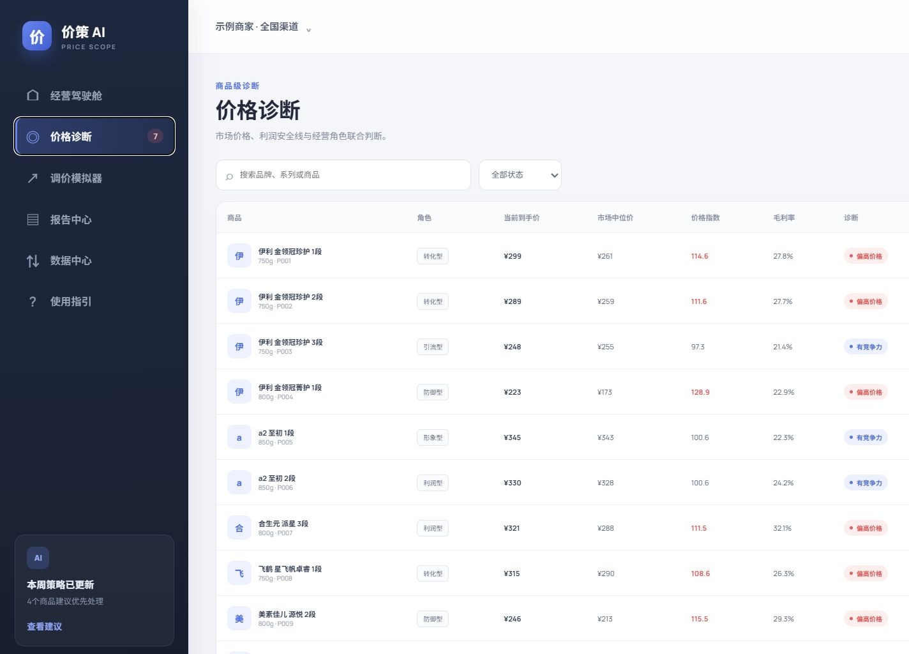
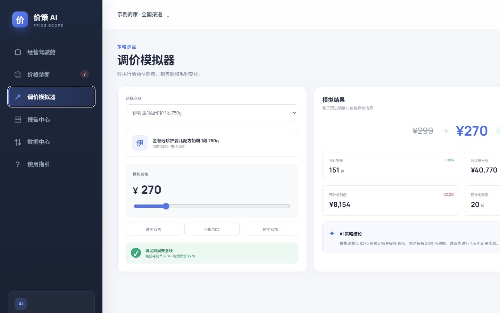
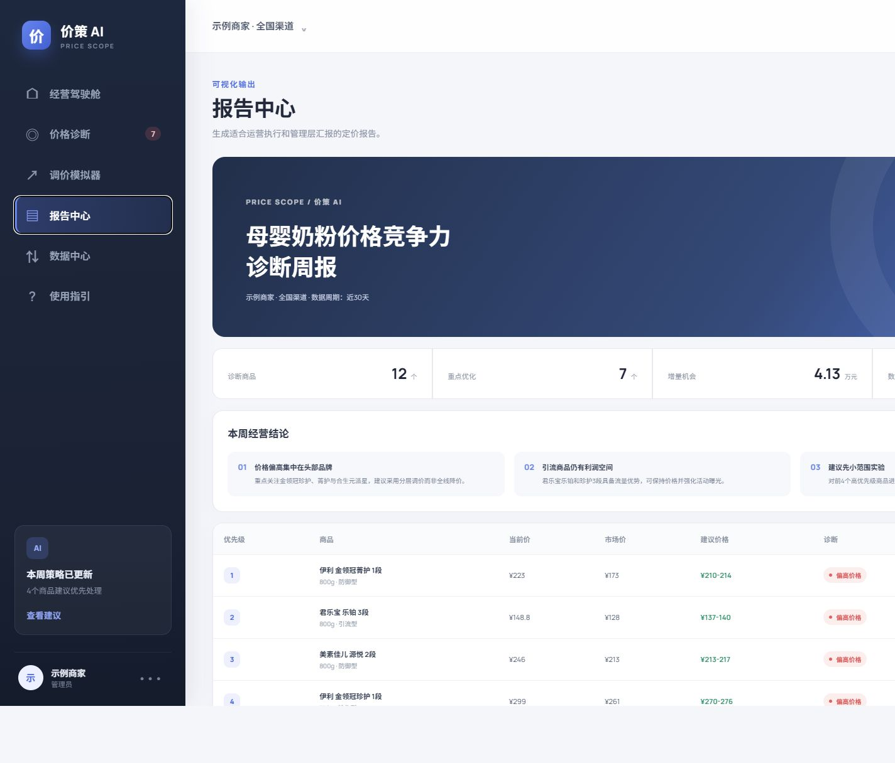

# 价策 AI 产品使用说明书

版本：1.3（真实到手价与优惠工作流版）
适用对象：电商运营、品类负责人、店铺负责人、采购与定价人员

## 1. 产品简介

价策 AI 是面向电商商家的价格情报与定价决策产品。系统从平台开放 API、合规公开商品页、用户本机授权态或 CSV 获得竞品公开价与优惠条件，分层核算真实到手价，再结合商家价格、成本、销量、库存与商品角色，完成价格健康度诊断、建议区间、调价模拟和可视化报告。

当前版本不会自动修改电商平台售价。演示数据保存在浏览器；本地采集服务只监听本机地址，不绕过登录、验证码、robots.txt 或访问控制。

## 2. 快速开始

1. 安装 Node.js 22.13 或更高版本与 pnpm。
2. 进入 `price-scope-ai` 目录，执行 `pnpm install` 和 `pnpm dev`。
3. 打开终端显示的本地地址，默认通常为 `http://127.0.0.1:4173`。
4. 首次进入时，系统自动加载 12 个母婴奶粉演示商品。
5. 如需真实公开页采集，另开终端执行 `pnpm collector:serve`。
6. 如需优惠链接与最优组合核算，再开一个终端执行 `python -m collector_python.api`。

## 3. 功能导航

- 经营驾驶舱：查看价格健康度、销售机会和优先调价商品。
- 价格采集中心：管理演示快照或本地公开页采集任务。
- 优惠策略中心：管理平台授权状态、商家优惠链接、领取规则和真实到手价。
- 价格诊断：查看商品级市场价格、毛利和调价建议。
- 价格拐点分析：识别价格趋势反转，联合市场价差和销量响应输出策略信号。
- 调价模拟器：模拟调价后的销量、销售额与毛利变化。
- 报告中心：生成运营清单和管理层可视化报告。
- 数据中心：通过 CSV 导入商家商品和竞品报价。
- 使用指引：查看操作流程、指标与定价策略。

## 4. 价格采集中心

### 4.1 演示快照模式

适用于面试展示和没有平台密钥的环境。点击“刷新演示快照”会更新时间，但数据仍明确标识为演示数据，不代表实时平台价格。

### 4.2 本地采集服务模式

1. 在项目目录运行 `pnpm collector:serve`。
2. 进入“价格采集中心”，选择“本地采集服务”。
3. 粘贴公开商品页 HTTPS 链接，每行一个。
4. 点击“立即采集”。
5. 查看平台、商品标题、价格、解析方式、采集时间与失败原因。

当前支持域名白名单：京东、天猫、淘宝、拼多多、苏宁易购和唯品会。采集器按顺序执行，最小请求间隔为 1.2 秒，检查 robots.txt，并依次尝试 JSON-LD、价格 Meta 和公开页面数据。

以下情况会明确失败：链接不是 HTTPS、平台不在白名单、robots.txt 禁止、页面要求登录或验证码、价格只在动态接口中返回、页面内容超过安全限制。

### 4.3 按品牌选择商品

1. 在“价格采集中心”切换到“按品牌选品”。
2. 选择品类、品牌、系列和规格，也可按名称或 SKU 搜索。品类来自当前货盘，不限于演示数据。
3. 逐个勾选商品，或点击“选择当前全部”。筛选后的批量选择不会包含列表之外的商品。
4. 选择目标平台，可多选京东、天猫、拼多多和即时零售。
5. 选择公开售价、条件可实现价或当前账户已持券价。
6. 点击“生成采集任务”。系统按“选中 SKU 数 × 平台数”创建任务。
7. 查看采集结果；没有高置信度同款的项目会标记失败并进入人工复核，而不是使用疑似商品价格。

建议先以商家的在售货盘为基准选择商品，不直接抓取某品牌全部搜索结果，以避免混入不同段位、规格、组合装和赠品装。

### 4.3 正式平台接入

商业环境应优先申请平台开放 API，使用商家自己的应用密钥、授权范围和限频配置。密钥只应存放在后端环境变量或密钥管理系统，不能提交到 GitHub 或暴露给浏览器。

## 5. 优惠策略中心

### 5.1 首次授权

系统默认先采集无需登录的公开售价。需要核算账户优惠时，用户在对应平台官方页面完成一次登录，之后复用本机浏览器授权状态；产品不要求用户把账号密码填写给价策 AI。授权失效时只需重新登录该平台。

### 5.2 优惠领取模式

- 仅识别：识别并计算优惠，不触发领取。
- 逐次确认（推荐）：领取前显示金额、门槛、有效期和限制，由用户确认。
- 规则授权：仅领取免费、无需实名且能降低目标商品价格的优惠；验证码、付费会员或支付步骤会暂停。

### 5.3 商家优惠链接

粘贴商家提供的官方优惠链接后，系统先检查 HTTPS 和平台域名，再读取活动标识、门槛、有效期和叠加关系。短链跳转后需再次校验最终域名。通过检查的优惠才进入最优组合核算。

### 5.4 价格口径

划线价仅作参考；公开售价可进入市场比较；条件可实现价必须展示领券或满减条件；已持券实际价只代表当前授权账户。会员、新客、地区和账户定向价格单独展示，不能混入公开市场中位数。完整规则见[真实到手价与优惠工作流](真实到手价与优惠工作流.md)。

## 6. CSV 数据导入

进入“数据中心”，点击“下载导入模板”。填写后点击“选择 CSV 文件”。

| 字段 | 用途 | 示例 |
|---|---|---|
| 商品编码 | SKU 唯一标识 | P001 |
| 品牌/系列/段位/规格 | 商品标准化与同款匹配 | 伊利/珍护/2段/750g |
| 当前价格/成本 | 价格指数与利润底价 | 289/209 |
| 近30天销量/转化率/库存 | 模拟与经营判断 | 156/4.2/360 |
| 商品角色 | 差异化策略 | 转化型 |
| 京东/天猫/拼多多价格 | 市场样本 | 261/257/251 |

要求：使用 UTF-8 CSV；价格只填写数字；平台价格应统一为实际到手价；不同规格应先换算或分开比较；每个商品建议至少有 3 个有效报价。

## 7. 价格诊断

诊断表包含当前到手价、市场中位价、价格指数、毛利率、诊断状态、建议区间和匹配可信度。

- 偏高价格：价格指数大于 106。
- 轻度偏高：价格指数大于 102 且不高于 106。
- 有竞争力：价格接近市场主流区间。
- 优势价格：低于主流区间且利润安全。
- 低价风险：价格明显偏低或毛利率低于安全线。

点击“详情”可查看各平台报价、加权市场价、利润底价、匹配可信度和 AI 判断依据。

## 8. 价格拐点分析

价格拐点分析用于发现“价格方向发生显著改变”的时刻，并判断它是否值得采取行动。进入左侧“价格拐点分析”，选择商品和敏感度后，系统会展示本店价、市场价、峰值/谷值标记、销量响应、可信度和建议动作。

- 降价止跌拐点：价格先下降后回升。若销量同步提升，可暂时维持价格并观察 3—7 天；若销量没有响应，应先检查流量、内容和同款匹配。
- 涨价转弱拐点：价格先上涨后回落。若本店价格仍显著高于市场，应进入调价模拟；若市场同步上涨，可暂缓降价。
- 敏感度：高敏感适合日常监控，标准适合周度运营，稳健适合管理层复盘。阈值越高，误报越少，但可能更晚发现变化。

识别方法：系统比较相邻时间点的价格斜率，只在方向反转且至少一侧变动超过阈值时生成信号，并用销量变化与市场价差增强解释。拐点是相关性信号，不代表调价必然造成销量变化；执行前需排除大促、缺货、广告投放和规格变化。

建议工作流：采集连续历史价格 → 选择标准敏感度 → 查看最新拐点 → 核对市场和销量信号 → 进入调价模拟 → 设置毛利停止线 → 进行 3—7 天实验。

## 9. 定价策略说明

### 8.1 统一价格口径

到手价 = 页面价格 + 运费 - 优惠券 - 满减 - 平台补贴。赠品需要按可比较价值折算；组合装先换算为单件或单位重量价格。只有品牌、系列、段位与规格一致或已经标准化的商品才能直接比较。

### 8.2 核心计算

- 市场中位价：有效同款报价的中位数，用于降低极端活动价的影响。
- 加权市场价：按平台可信度与样本权重计算的市场参考价。
- 价格指数 = 本店到手价 ÷ 市场中位价 × 100。
- 利润底价 = 商品成本 ÷（1 - 最低毛利率）。
- 建议区间：市场价格带与商品角色目标的交集，并始终受利润底价约束。

### 8.3 商品角色策略

| 角色 | 经营目标 | 建议动作 | 重点指标 |
|---|---|---|---|
| 引流型 | 获取访问与新客 | 靠近市场低位，但不击穿利润底价 | 访客成本、连带率、新客数 |
| 转化型 | 提升下单效率 | 保持市场中位价附近，先做小流量实验 | 转化率、销量弹性、销售额 |
| 利润型 | 贡献毛利 | 允许合理溢价，用价值表达替代直接降价 | 毛利额、折扣深度、复购率 |
| 防御型 | 对标重点竞品 | 紧跟目标竞品的有效到手价 | 价格差、份额、流失率 |
| 形象型 | 强化品牌定位 | 跟随头部标杆，减少频繁波动 | 稳定性、品牌搜索量 |
| 清仓型 | 加快库存周转 | 在利润和渠道约束内更积极降价 | 库存天数、售罄率 |

### 8.4 进攻、平衡与保守方案

- 进攻价：建议区间低位，适合引流、清仓或竞争加剧场景。
- 平衡价：建议区间中点，兼顾转化率与毛利，适合默认实验。
- 保守价：建议区间高位，适合利润型、形象型或库存紧张商品。

### 8.5 决策护栏

1. 匹配可信度不足时先人工审核，不自动给出执行动作。
2. 任何方案不得低于利润底价。
3. 单次大幅调价拆为 7 天实验，设置销量和毛利双重停止条件。
4. 促销期与日常价分开建模，避免把短时补贴当成长期市场价。
5. 价格只是一个杠杆，还需结合流量、内容、履约与库存判断。

## 10. 调价模拟器

1. 选择商品。
2. 输入价格，或选择进攻、平衡、保守方案。
3. 查看预计销量、销售额、毛利额与毛利率。
4. 确认“满足利润安全线”。
5. 将通过安全线的方案用于 7 天小范围实验。

当前 MVP 使用固定价格弹性系数演示。真实商用应按品类、价格带、活动类型和用户分层训练弹性模型。

## 11. 报告中心

- “导出调价清单”下载 CSV，供运营审核和执行。
- “打印 / 保存 PDF”调用浏览器打印，生成管理层周报。

报告包括综合健康度、重点优化商品、增量机会、数据覆盖、经营结论和建议动作。

### 11.1 同品牌头部 SKU 跨平台价格报告

1. 进入“报告中心”，切换到“品牌跨平台比价”。
2. 选择品类和需要分析的品牌。
3. 选择 Top 3、Top 5 或 Top 10。系统按照近 30 天销量确定头部 SKU。
4. 横向查看矩阵：每行一个标准 SKU，每个平台独立成列；绿色单元格代表该 SKU 当前最低平台价。
5. 查看最低价平台、跨平台价差率和系统价格结论。
6. 查看平台价格指数和 SKU 价差条形图，快速识别高价平台与异常商品。
7. 点击“导出矩阵”，获得 CSV 文件。

当前演示货盘包括母婴奶粉、食品饮料、家用电器和个护清洁。导入 CSV 时填写“品类”字段即可增加新类目，系统会自动生成对应筛选项。

报告不会因为品牌相同就把不同商品混为同款，仍以系列、段位和规格逐 SKU 比较。账户专属优惠不进入公开平台价格矩阵，需要在优惠策略中心单独查看。

## 12. 建议工作流

1. 定期运行授权 API、公开页采集或 CSV 导入。
2. 检查采集成功率、时间和同款匹配可信度。
3. 优先处理偏高价格和低价风险商品。
4. 确认市场价格带、利润底价和商品角色。
5. 在模拟器比较三种方案。
6. 导出清单并完成负责人审核。
7. 对少量商品执行 7 天实验。
8. 复盘销量、转化率、销售额与毛利，再扩大执行。

## 13. 数据安全与合规

- 演示业务数据保存在浏览器 localStorage，清理浏览器数据会丢失。
- 本地采集服务只监听 `127.0.0.1`，不对公网开放。
- 不采集登录后、验证码保护或 robots.txt 禁止的页面。
- 不在仓库保存平台密钥、Cookie 或个人账号信息。
- 生产环境应记录授权主体、请求频率、数据用途和保留期限。
- 最终定价必须由有权限的业务人员审核。

## 14. 常见问题

### 为什么公开页采集失败？

平台可能采用动态渲染、登录校验、验证码或 robots 限制。系统不会绕过这些控制，请改用官方开放 API 或 CSV。

### 商品全部显示偏高？

检查报价是否为到手价、规格是否一致，是否把组合装总价与单件价混在一起。

### 建议价格为什么高于市场价？

通常由利润底价或商品角色约束导致。检查成本、最低毛利率和商品角色。

### 如何恢复演示数据？

进入数据中心，点击“恢复演示数据”。

## 15. 商用升级建议

- 接入平台开放 API、授权续期与调用监控。
- 增加定时任务、历史价格数据库和异常告警。
- 增加商品匹配人工审核工作台。
- 保存调价审批、执行和实验记录。
- 使用真实历史数据训练分品类价格弹性模型。
- 建立多角色权限、数据隔离与策略回写机制。
