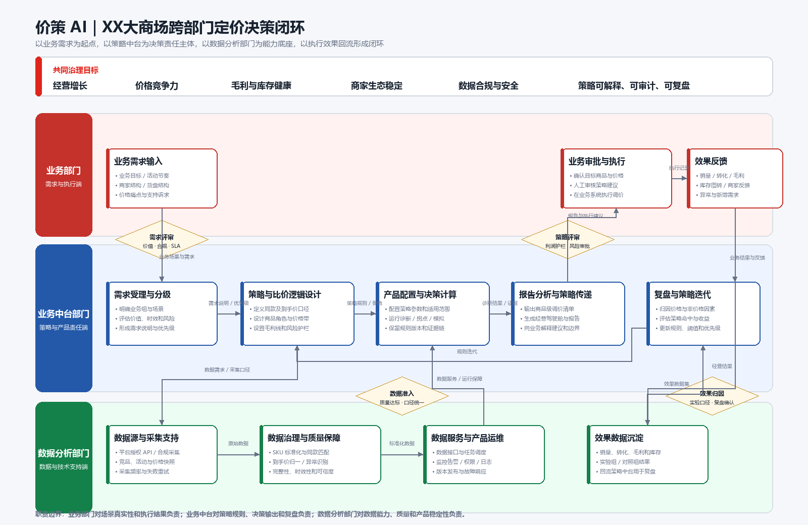

# 价策 AI｜XX大商场跨部门工作流程图

本目录用于展示价策 AI 在大商场业务背景下的跨部门协同机制。

## 流程定位

以业务需求为起点，以业务中台为定价策略责任主体，以数据分析部门为数据与技术底座，通过产品报告支持业务审批与执行，并将经营结果回流形成策略迭代闭环。

## 三方职责

- **业务部门（需求与执行端）**：提供业务目标、活动节奏、商家结构、货盘结构与价格痛点；审核策略建议、执行调价并反馈经营结果。
- **业务中台部门（策略与产品责任端）**：受理和分级需求，设计分业务组的同款、到手价、商品角色、价格带及利润护栏逻辑；配置产品策略、输出报告并负责效果复盘。
- **数据分析部门（数据与技术支持端）**：建设授权 API、合规采集、SKU 标准化、同款匹配、到手价归一与数据质量能力；负责数据服务、任务调度、监控告警和产品运维。

## 关键控制点

1. 需求评审：确认业务价值、合规性与服务时效。
2. 数据准入：确认数据质量、时效和口径一致性。
3. 策略评审：确认利润护栏、风险边界和审批权限。
4. 效果归因：使用统一实验口径复盘销量、转化、毛利和库存变化。

## 文件说明

- `价策AI_XX大商场跨部门协同流程图.vdx`：可使用 Microsoft Visio 打开并继续编辑。
- `价策AI_XX大商场跨部门协同流程图.svg`：矢量版本，适合网页和文档引用。
- `价策AI_XX大商场跨部门协同流程图_预览.png`：高清预览图，适合 GitHub 直接展示。

